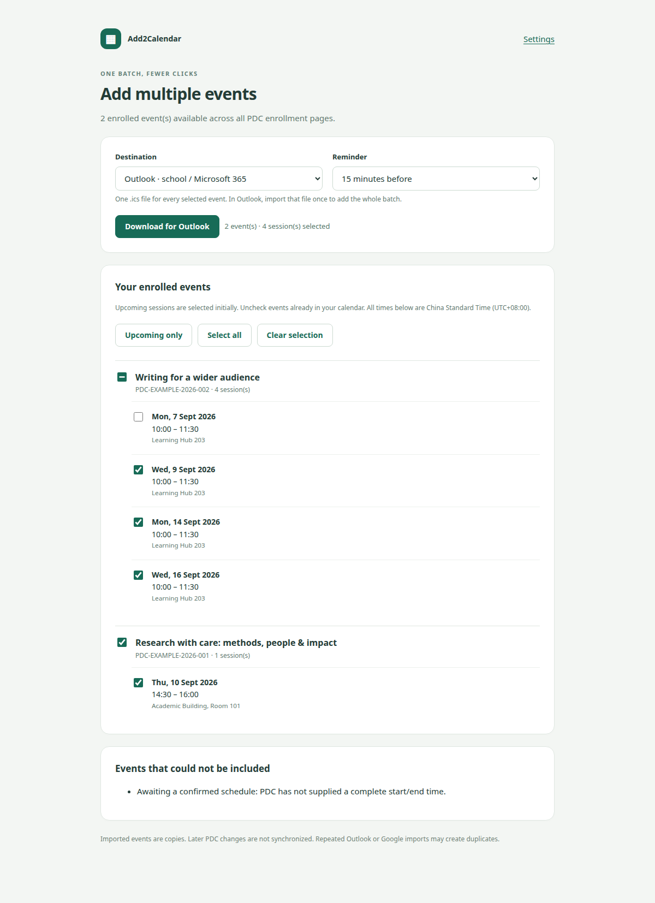

# Add2Calendar

[English](README.md) | **简体中文**

**香港科技大学（广州）的日历导出工具。** Add2Calendar 是一个 Chrome 扩展，帮助你把校园安排放进日常使用的日历。目前它会在 [PDC 系统](https://pdc.hkust-gz.edu.cn/enrollment-records)中添加 **Add to calendar（添加到日历）** 和 **Add multiple events（批量添加活动）** 按钮，将已报名的讲座、研讨会等活动加入 Outlook、Google 日历、Nextcloud，或导出为 `.ics` 文件。

**[下载最新版本](https://github.com/LueApp/add2calendar/releases/latest)** · [全部版本](https://github.com/LueApp/add2calendar/releases) · [反馈问题](https://github.com/LueApp/add2calendar/issues)

## 项目网站

中英文项目网站位于 `site/`，不依赖任何前端框架。运行以下命令构建：

```sh
npm run site:build
```

可部署的网站会生成到 `web-dist/`，其中包含当前版本的扩展 ZIP。在 Cloudflare Pages 控制台连接 Git 仓库时，将构建命令设为 **`npm run site:build`**，输出目录设为 **`web-dist`**。无需配置环境变量。

## 主要功能

- 在 **Event Enrollment（活动报名）** 和 **Enrollment Records（报名记录）** 页面添加日历按钮。
- 读取**所有分页**中的报名记录，选择多个活动和场次后批量导出。
- 保留各活动的名称、日期、时间、地点、讲者及来源链接。
- 支持一个活动包含多场会议，以及按星期重复的安排。
- 按**中国标准时间 UTC+08:00** 处理 PDC 时间，不受电脑当前时区影响。
- 使用已有 PDC 登录会话；学校的双重认证仍由你正常完成。

**添加的是活动副本，PDC 后续的改期和取消不会自动同步到日历。** 本项目是独立的学生工具，并非学校官方应用。



*截图使用虚构活动。扩展界面目前为英文，本文提供中文操作说明。*

## 在 Chrome 中安装

需要 **Google Chrome 120 或更新版本**。普通使用者不需要安装 Node.js、Python，也不需要部署服务器。

1. 从 [Releases 发布页面](https://github.com/LueApp/add2calendar/releases/latest)下载扩展 ZIP，解压到一个以后不会随意移动的文件夹。
2. 在 Chrome 地址栏打开 `chrome://extensions`，开启右上角的**开发者模式**。
3. 点击**加载已解压的扩展程序**，选择**直接包含 `manifest.json` 的文件夹**。
4. 刷新 PDC 标签页，并正常登录。
5. 进入 **Event Enrollment** 或 **Enrollment Records**。已报名活动旁会出现日历按钮。

| 下载方式 | 在 Chrome 中应选择的目录 |
| --- | --- |
| Release 附件（`.zip`） | 解压后的文件夹，其根目录直接包含 `manifest.json` |
| GitHub 的 **Code → Download ZIP**，或 `git clone` | 源码目录内的 `extension` 子文件夹 |

**“清单文件缺失或不可读取”**表示 Chrome 无法在所选目录中直接找到 `manifest.json`。不要选择 ZIP 文件本身，也不要选择它的上一级目录。早期 v0.1.0 压缩包多包含了一层 `extension` 子文件夹。

## 批量导入 Outlook

1. 在 PDC 表格上方点击 **Add multiple events（批量添加活动）**。
2. 选择 **Outlook · school / Microsoft 365（学校账号）** 或 **Outlook.com · personal（个人账号）**。
3. 勾选需要添加的活动和场次。默认选中尚未结束的场次，也可用 **Select all（全选）**、**Upcoming only（仅选择尚未结束的场次）**、**Clear selection（清空选择）** 调整。
4. 点击 **Download for Outlook（下载 Outlook 日历文件）**。所有选中的场次会保存在**同一个 `.ics` 文件**中，每个活动仍保留自己的名称和详细信息。
5. 在 Outlook 中打开**日历 → 添加日历 → 从文件上传**，选择刚下载的文件及目标日历，然后点击一次**导入**或**导入并保存**。

**整个批次仍需要确认导入一次。** 请取消勾选已经加入 Outlook 的活动：扩展无法读取你的 Outlook 日历，重复导入可能产生重复条目。缺少有效时间安排的活动会在预览中单独列出。

只添加一个活动时，可点击它旁边的 **Add to calendar**。只选择一场会议时，Outlook 会打开已填写好信息的页面，由你确认保存；选择多场时，则可通过 **Download for Outlook** 一次导入。

## 支持哪些日历

| 目标日历 | 单个场次 | 批量添加 |
| --- | --- | --- |
| 学校 Outlook / Microsoft 365 | 打开预填网页，确认保存 | 导入一个 `.ics` 文件 |
| 个人 Outlook.com | 打开预填网页，确认保存 | 导入一个 `.ics` 文件 |
| Google 日历 | 打开预填网页，确认保存 | 在**设置 → 导入和导出**中导入一个 `.ics` 文件 |
| Nextcloud | 配置后直接写入 | 直接写入所有选中的场次 |
| Apple 日历、Thunderbird 等 | 导入 `.ics` 文件 | 导入合并后的 `.ics` 文件 |

每位使用者都可以选择自己的账号。Outlook 和 Google 的登录在各自的网站完成，无需在本扩展中填写这些账号的密码。扩展内的提醒设置用于 Nextcloud 和 `.ics` 导出；通过预填网页添加时，请在日历编辑器内设置提醒。提醒是否发出以及如何发出，由实际使用的日历应用决定。

## 配置 Nextcloud（可选）

1. 在 Nextcloud 日历中创建或选择一个有写入权限的日历，例如 **PDC Seminars**。
2. 打开该日历旁的 **⋯** 菜单，复制它的**私有链接**。格式应类似：

   ```text
   https://cloud.example.com/remote.php/dav/calendars/USERNAME/CALENDAR/
   ```

3. 在 Nextcloud 的**设置 → 安全**中创建名为 **Add2Calendar** 的应用密码。
4. 通过扩展工具栏图标或预览中的 **Settings（设置）** 打开配置页，填写日历私有链接、Nextcloud 用户名和应用密码。
5. 点击 **Save Nextcloud connection（保存 Nextcloud 连接）**，并允许 Chrome 访问所填写的服务器。
6. 在单个活动或批量预览中选择 **Nextcloud**，勾选场次并点击添加按钮。

请使用**某个具体日历**的私有链接，不要填写公开分享链接、日历应用首页或整个账号的 CalDAV 地址。保存配置时不会创建测试活动；账号信息在实际添加时验证。

扩展会跳过此前由本扩展添加、且活动编码与起止时间一致的场次，不会覆盖现有条目。手动创建或通过其他工具导入的条目可能无法识别为重复。重新添加已改期的活动会产生新的时间条目，旧条目需要自行处理。

## 更新已安装的扩展

1. 下载并解压新版本。
2. 将新文件复制到**最初加载扩展时选择的同一个文件夹**，覆盖旧的扩展文件。
3. 在 `chrome://extensions` 中点击扩展卡片上的**重新加载**。
4. 刷新 PDC 页面。

请保留安装文件夹。继续使用同一路径可以保留已解压扩展的身份和设置。扩展尚未上架 Chrome 应用商店，因此需要手动更新；部分学校或单位管理的浏览器可能禁止加载已解压扩展。

## 隐私与使用限制

- 不使用数据统计、第三方后端或 AI 服务。
- PDC 登录令牌仅用于向 PDC 发起读取请求，不会发送给日历服务商，也不会保存到扩展设置中。
- Nextcloud 连接信息保存在扩展本地存储中，不进入 Chrome 同步，也不向 PDC 页面脚本开放。应用密码**没有额外的静态加密保护**，建议使用专门创建、可单独撤销的应用密码。
- 扩展不会代替你报名、退选，也不会绕过学校登录或双重认证。
- 适配的网站是香港科技大学（广州）PDC。网站内部接口改变时，扩展可能需要更新。
- 导入的活动不是订阅。请留意 PDC 后续的改期和取消。

详见[隐私说明](PRIVACY.zh-CN.md)及[验证记录（英文）](VALIDATION.md)。

## 常见问题

| 问题 | 处理方式 |
| --- | --- |
| 看不到日历按钮 | 重新加载扩展并刷新 PDC，允许扩展访问该网站，然后检查 **Enrollment Records**。按钮只针对已报名活动显示。 |
| 提示 PDC 登录过期 | 正常重新登录，再刷新 PDC 页面。 |
| 批量预览中没有勾选场次 | 默认只选择尚未结束的场次。如果需要过去的活动，点击 **Select all**。 |
| 某个时间安排无法导出 | 检查 PDC 是否已发布有效日期、时间及每周上课日。扩展不会猜测不明确的时间。 |
| Outlook 链接未保留信息或账号类型不对 | 选择对应的学校／个人选项，或使用 `.ics` 文件导入。 |
| Nextcloud 拒绝连接 | 检查具体日历的私有链接、实际用户名、应用密码和写入权限。 |
| 部分 Nextcloud 活动添加失败 | 查看结果数量后重试；此前成功添加的相同场次会被跳过。 |

反馈问题时请附上扩展版本和错误提示。分享截图或日志前，请移除登录令牌、应用密码、学号及不希望公开的活动详情。

## 开发与测试

扩展本身没有运行时依赖，也不需要构建。开发环境需要 **Node.js 22+**、**npm** 和 **Python 3**；Playwright 仅用于浏览器测试。

```sh
git clone https://github.com/LueApp/add2calendar.git
cd add2calendar
npm ci
npm test
npx playwright install chromium
npm run test:browser
npm run package
```

安装包生成在 `dist/` 中。若直接加载源码，请在 Chrome 中选择 `extension/`。

| 路径 | 用途 |
| --- | --- |
| `extension/content.js` | PDC 页面适配及按钮注入 |
| `extension/event.*`、`extension/batch.*` | 单个活动与批量预览 |
| `extension/lib/` | 时间转换、iCalendar 导出及 CalDAV 写入 |
| `tests/` | 使用虚构活动数据的单元测试 |
| `scripts/browser-test.mjs` | 在模拟 PDC／日历响应下测试真实扩展 |
| `scripts/package.py` | 生成根目录包含 `manifest.json` 的 ZIP 安装包 |

v0.2.0 已通过 **18 项单元测试和 12 项浏览器集成检查**。自动化测试不会写入真实学生日历。测试范围及仍需实测的项目见 [VALIDATION.md](VALIDATION.md)。

## 许可证与参考资料

采用 [MIT 许可证](LICENSE)。

[Outlook 日历导入](https://support.microsoft.com/en-us/outlook/import-or-subscribe-to-a-calendar-in-outlook-com-or-outlook-on-the-web) · [Google 日历导入](https://support.google.com/calendar/answer/37118?hl=zh-Hans) · [Nextcloud 日历文档](https://docs.nextcloud.com/server/stable/user_manual/en/groupware/calendar.html) · [iCalendar RFC 5545](https://www.rfc-editor.org/rfc/rfc5545)
